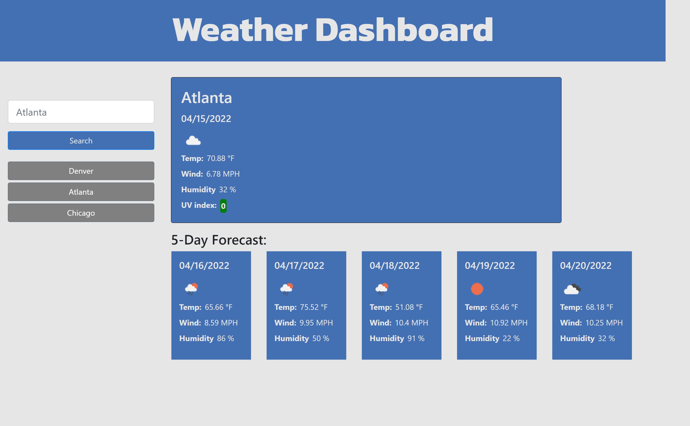

# Weather Dashboard

## Description

For this project, I created a Weather Dashboard so you can search cities and have the current weather as well as 5-day forecast displayed.

## Purpose

The purpose of this project is to build a weather dashboard using all the knowledge I gained during bootcamp. This project really tested my skills in Javascript and usage of third-party APIs.

## Result

The below picture is the final result.

>The Weather Dashboard displays the current weather and 5-day forecast for the city the user searched. It will also be added to the search history so the user can access the information simply by clicking on it.
>
>
>

## Languages Used

- HTML
- CSS
- JavaScript

## Libraries Used

- Bootstrap
- Moment.js
- Google Fonts
- Open Weather

## Link To Deployed Page

- [Weather Dashboard](https://james-y-wong.github.io/hw-6-weather-dashboard/)