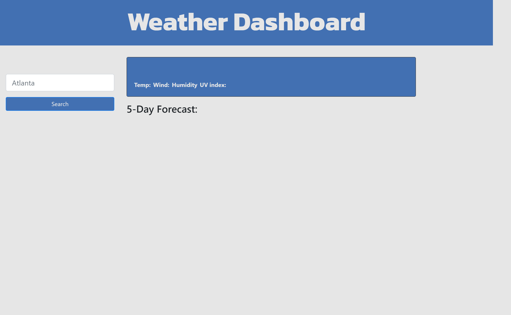

# Weather Dashboard

## Description

For this project, I created a Weather Dashboard so you can search cities and have the current weather as well as 5-day forecast displayed.

## Purpose

The purpose of this project is to build a weather dashboard using all the knowledge I gained during bootcamp. This project really tested my skills in Javascript and usage of third-party APIs.

## Result

The below picture is the final result.

>Here is the Weather Dashboard on initial load.
>
>
>

>The Weather Dashboard displays the current weather and 5-day forecast for the city the user searched. It will also be added to the search history so the user can access the information simply by clicking on it.
>
>
>

## Languages Used

- HTML
- CSS
- JavaScript

## Libraries Used

- Bootstrap
- Moment.js
- Google Fonts
- Open Weather

## Link To Deployed Page

- [Weather Dashboard](https://james-y-wong.github.io/hw-6-weather-dashboard/)

## Contact Information

- Email: jamesyeuwong@gmail.com
- [LinkedIn](https://www.linkedin.com/in/james-wong-90652497)
- [GitHub](https://github.com/James-Y-Wong)

## License

MIT License

Copyright (c) 2022 James Wong

Permission is hereby granted, free of charge, to any person obtaining a copy
of this software and associated documentation files (the "Software"), to deal
in the Software without restriction, including without limitation the rights
to use, copy, modify, merge, publish, distribute, sublicense, and/or sell
copies of the Software, and to permit persons to whom the Software is
furnished to do so, subject to the following conditions:

The above copyright notice and this permission notice shall be included in all
copies or substantial portions of the Software.

THE SOFTWARE IS PROVIDED "AS IS", WITHOUT WARRANTY OF ANY KIND, EXPRESS OR
IMPLIED, INCLUDING BUT NOT LIMITED TO THE WARRANTIES OF MERCHANTABILITY,
FITNESS FOR A PARTICULAR PURPOSE AND NONINFRINGEMENT. IN NO EVENT SHALL THE
AUTHORS OR COPYRIGHT HOLDERS BE LIABLE FOR ANY CLAIM, DAMAGES OR OTHER
LIABILITY, WHETHER IN AN ACTION OF CONTRACT, TORT OR OTHERWISE, ARISING FROM,
OUT OF OR IN CONNECTION WITH THE SOFTWARE OR THE USE OR OTHER DEALINGS IN THE
SOFTWARE.
